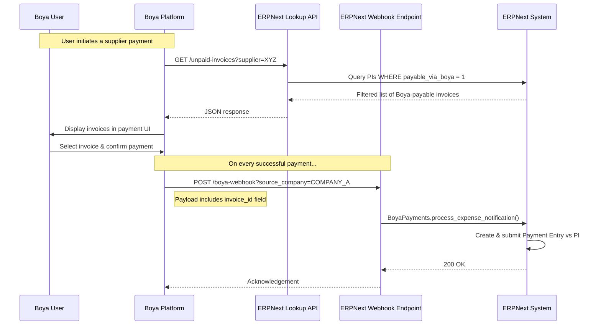

# Boya–ERPNext Accounts Payable Integration — API Specification

**Version:** 1.1 (Revised)
**Date:** 2026-05-11
**Status:** Draft — Pending Boya Engineering Review

---

## Architecture Overview

This integration uses a **webhook push** model — Boya's platform pushes a notification to ERPNext on every successful transaction. ERPNext processes it immediately and creates the appropriate financial entry.



### Purchase Invoice Filter: "Payable via Boya"

Not all Purchase Invoices are paid through Boya. A custom checkbox field `custom_payable_via_boya` on the Purchase Invoice doctype controls which invoices are visible to Boya's platform.

> [!IMPORTANT]
> **Only Purchase Invoices with `Payable via Boya = Yes` will appear in the lookup endpoints.** This ensures Boya never sees invoices intended for other payment channels (direct bank transfer, cheque, etc.).
>
> ERPNext users must tick this checkbox on the Purchase Invoice before it becomes available for Boya payment.

| Field | Doctype | Type | Default |
|-------|---------|------|---------|
| `custom_payable_via_boya` | Purchase Invoice | Checkbox | `0` (unchecked) |

### Why Webhook (Push) and Not Polling (Pull)?

| | Push (Webhook) ✅ | Pull (Cron Job) ❌ |
|--|--|--|
| **Timeliness** | Real-time | Up to ~15 min delay |
| **Efficiency** | Only fires on new transactions | Polls even when idle |
| **Reliability** | Boya can retry on failure | Missed transactions need manual recovery |
| **Scalability** | Scales with Boya's transaction volume | Cron load grows with history size |

> [!IMPORTANT]
> The cron job (pull) approach was a **temporary workaround** due to the multi-company webhook misconfiguration. The goal of this integration is to revert to the **push webhook model**, with the multi-company issue fixed via per-company webhook URLs as described below.

---

## Multi-Company Webhook Configuration

The previous webhook setup used a single URL with a hardcoded company, which caused inter-company journal entries for transactions belonging to other companies.

### The Fix: One Webhook URL Per Company

Boya must configure **one webhook endpoint per company**, each URL containing a `source_company` query parameter:

| Company | Webhook URL |
|---------|-------------|
| Company A | `https://<domain>/api/method/boya_integration.boya_integration.custom_methods.api_methods.boya_payments_api?source_company=THE EAST AFRICAN SMART VILLAGES %26 RURAL MOBILITY LIMITED` |
| Company B | `https://<domain>/api/method/boya_integration.boya_integration.custom_methods.api_methods.boya_payments_api?source_company=SONGA MOBILITY LIMITED` |
| Company N | `https://<domain>/api/method/boya_integration.boya_integration.custom_methods.api_methods.boya_payments_api?source_company=<company_name>` |

> [!NOTE]
> ERPNext already supports `source_company` as a query parameter on the existing webhook endpoint. Boya only needs to update their webhook configuration URLs — no code changes are required on the Boya side beyond this.

---

## Authentication

All requests must include an `Authorization` header using Frappe's standard API Key + Secret format:

```
Authorization: token <api_key>:<api_secret>
```

**Example:**
```http
Authorization: token a1b2c3d4e5f6:9z8y7x6w5v4u
```

Separate API key pairs will be provisioned for:
- Staging / testing environment
- Production environment

---

## Base URL

```
https://<erpnext-domain>/api/method/boya_integration.boya_integration.custom_methods
```

---

## Endpoint 1 — Transaction Webhook (Push)

This is the **primary integration point**. Boya calls this endpoint on every successful payment. ERPNext will create the corresponding financial entry (Payment Entry if a Purchase Invoice ID is found in the notes, otherwise a Journal Entry).

```
POST /api_methods.boya_payments_api?source_company=<company_name>
```

### Request Body

This is Boya's **existing webhook payload** — no structural changes required. The only new field is `invoice_id` (see below).

```json
{
  "_id": "64abc123def456",
  "transaction_ref": "M-YTDCY6IXREKQTT",
  "provider_ref": "PAY-REF-12345",
  "amount": 1200.00,
  "fees": 15.00,
  "charge": 1215.00,
  "currency": "KES",
  "original_currency": "KES",
  "fx_rate": 1,
  "transaction_date": "2026-05-11T10:30:00Z",
  "createdAt": "2026-05-11T10:30:00Z",
  "payment_type": "expense",
  "channel": "MPESA",
  "payment_status": "completed",
  "status": "approved",
  "employee_id": "EMP-001",
  "person": "John Doe",
  "receiver": "USA General Traders",
  "accno": "254712345678",
  "card_vcn": null,
  "merchant_category_code": null,
  "notes": "Payment for Receipt Book\nACC-PINV-2026-00835",
  "invoice_id": "ACC-PINV-2026-00835",
  "vendor": "USA General Traders",
  "subcategory": {
    "_id": "sub123",
    "name": "Office Supplies",
    "code": "4110",
    "description": "Office supplies and stationery",
    "group_id": "grp01",
    "mapping_id": "map01",
    "status": "active",
    "category": "Expenses",
    "createdAt": "2026-01-01T00:00:00Z",
    "updatedAt": "2026-01-01T00:00:00Z",
    "__v": 0
  },
  "reviews": [],
  "attachments": [],
  "tag": [],
  "team": [],
  "exported": false,
  "sync_successful": false,
  "external_sync_id": null,
  "sync_error": null
}
```

### Key Field: `invoice_id` ⭐

> [!IMPORTANT]
> This is the **critical new field** for this integration. Boya must populate `invoice_id` with the ERPNext Purchase Invoice ID when the user selects a specific invoice to pay against.
>
> When `invoice_id` is present, ERPNext will create a **Payment Entry** linked directly to that Purchase Invoice.
> When `invoice_id` is absent, ERPNext falls back to creating a **Journal Entry** (existing behaviour for unmatched expenses).

| Field | Type | Required | Description |
|-------|------|----------|-------------|
| `invoice_id` | string | **Conditional** | ERPNext Purchase Invoice ID (e.g., `ACC-PINV-2026-00835`). Must be a submitted, unpaid PI. |

All other fields follow the existing Boya webhook payload structure.

### Success Response — `200 OK`

```json
{
  "message": "Webhook received and processed successfully."
}
```

> [!NOTE]
> ERPNext responds with `200 OK` immediately to acknowledge receipt. Financial entry creation happens synchronously. If Boya does not receive a 200, it should retry with exponential backoff.

### Error Response — `500 Internal Server Error`

```json
{
  "exc_type": "ValidationError",
  "exception": "...",
  "message": "Validation failed: ..."
}
```

---

## Endpoint 2 — List Unpaid Purchase Invoices

A read-only endpoint for Boya's payment UI to display available unpaid invoices when a user initiates a payment against a specific supplier.

```
GET /boya_api_v2.get_unpaid_invoices
```

### Query Parameters

| Parameter | Type | Required | Description |
|-----------|------|----------|-------------|
| `company` | string | No | Filter by company. Defaults to Boya Settings default. |
| `supplier` | string | No | Exact supplier name filter |
| `supplier_search` | string | No | Partial supplier name search |
| `from_date` | string | No | Posted on or after (`YYYY-MM-DD`) |
| `to_date` | string | No | Posted on or before (`YYYY-MM-DD`) |
| `page` | integer | No | Page number (default: `1`) |
| `page_size` | integer | No | Results per page (default: `20`, max: `100`) |

> [!NOTE]
> This endpoint **always** filters on `custom_payable_via_boya = 1`. Only invoices explicitly marked as payable via Boya will be returned. This filter is applied server-side and cannot be overridden by the caller.

### Success Response — `200 OK`

```json
{
  "message": {
    "status": "success",
    "data": {
      "invoices": [
        {
          "name": "ACC-PINV-2026-00835",
          "supplier": "USA General Traders",
          "company": "THE EAST AFRICAN SMART VILLAGES & RURAL MOBILITY LIMITED",
          "posting_date": "2026-04-22",
          "due_date": "2026-04-18",
          "currency": "KES",
          "grand_total": 1200.00,
          "outstanding_amount": 1200.00,
          "status": "Overdue",
          "bill_no": "66331"
        }
      ],
      "pagination": {
        "page": 1,
        "page_size": 20,
        "total_count": 47,
        "total_pages": 3
      }
    }
  }
}
```

---

## Endpoint 3 — Get Purchase Invoice Details

Fetch full details of a specific Purchase Invoice for Boya's payment confirmation screen.

```
GET /boya_api_v2.get_invoice_details?invoice_id=ACC-PINV-2026-00835
```

### Query Parameters

| Parameter | Type | Required | Description |
|-----------|------|----------|-------------|
| `invoice_id` | string | **Yes** | ERPNext Purchase Invoice ID |

### Success Response — `200 OK`

```json
{
  "message": {
    "status": "success",
    "data": {
      "invoice": {
        "name": "ACC-PINV-2026-00835",
        "supplier": "USA General Traders",
        "company": "THE EAST AFRICAN SMART VILLAGES & RURAL MOBILITY LIMITED",
        "posting_date": "2026-04-22",
        "due_date": "2026-04-18",
        "currency": "KES",
        "grand_total": 1200.00,
        "outstanding_amount": 1200.00,
        "paid_amount": 0.00,
        "status": "Overdue",
        "bill_no": "66331",
        "bill_date": "2026-04-16",
        "items": [
          {
            "item_name": "Receipt Book",
            "qty": 1,
            "rate": 1200.00,
            "amount": 1200.00
          }
        ]
      }
    }
  }
}
```

### Error Responses

```json
{ "message": { "status": "error", "error_code": "INVOICE_NOT_FOUND", "error_message": "Purchase Invoice does not exist." } }
```
```json
{ "message": { "status": "error", "error_code": "INVOICE_ALREADY_PAID", "error_message": "Purchase Invoice has no outstanding balance." } }
```

---

## Error Code Reference

| Error Code | HTTP Status | Description |
|------------|-------------|-------------|
| `INVOICE_NOT_FOUND` | 404 | The specified Purchase Invoice does not exist |
| `INVOICE_NOT_SUBMITTED` | 400 | The Purchase Invoice is in Draft status |
| `INVOICE_ALREADY_PAID` | 400 | The Purchase Invoice has no outstanding balance |
| `DUPLICATE_TRANSACTION` | 409 | `transaction_ref` already processed |
| `PAYMENT_ENTRY_FAILED` | 500 | ERPNext failed to create/submit the Payment Entry |
| `AUTHENTICATION_FAILED` | 401 | Invalid or missing API credentials |
| `INVALID_PARAMETER` | 400 | A request field is invalid |

---

## Migration from Current Cron Job Approach

| Step | Action | Owner |
|------|--------|-------|
| 1 | ERPNext adds `custom_payable_via_boya` checkbox to Purchase Invoice | **ERPNext Team** |
| 2 | ERPNext implements Endpoints 2 & 3 (invoice lookup, filtered by the checkbox) | **ERPNext Team** |
| 3 | Boya configures one webhook URL per company with `source_company` param | **Boya** |
| 4 | Boya adds `invoice_id` field to webhook payload when user selects a PI | **Boya** |
| 5 | Boya builds invoice selection UI using the lookup endpoints | **Boya** |
| 6 | ERPNext re-enables the webhook handler (uncomment disabled line in `api_methods.py`) | **ERPNext Team** |
| 7 | Joint testing on staging | **Both** |
| 8 | Cron job disabled on production | **ERPNext Team** |
| 9 | Go live | **Both** |

---

## Environments

| Environment | Domain | API Keys |
|-------------|--------|----------|
| Staging | `https://staging.<domain>` | Shared separately |
| Production | `https://<domain>` | Shared separately |
